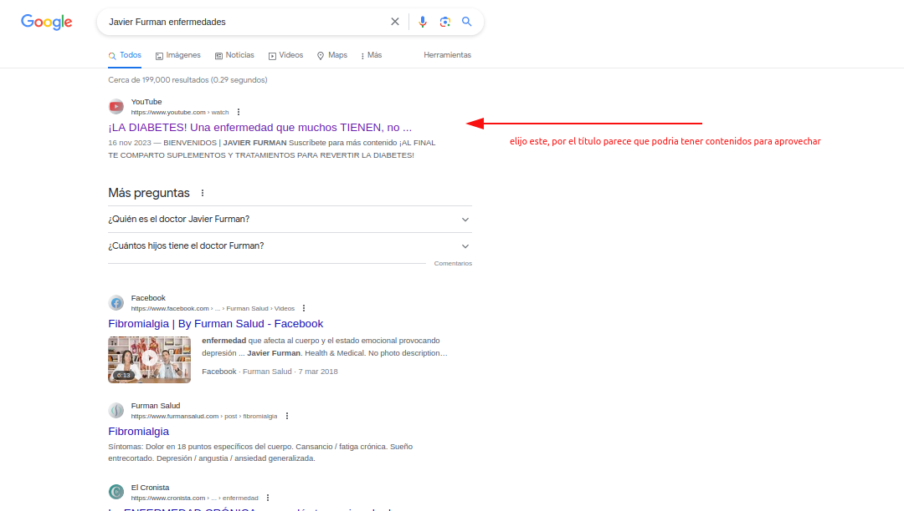
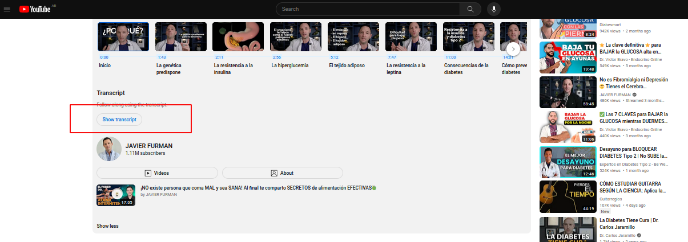
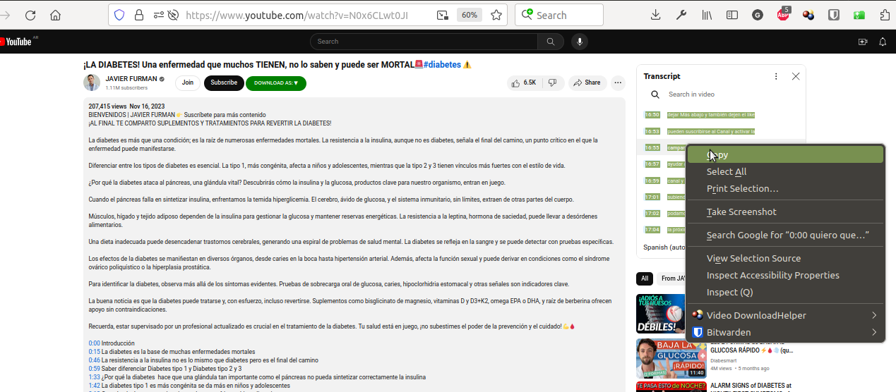

<link rel="stylesheet" type="text/css" media="all" href="stylesheet.css" />

# Generar contenidos sin contenidos (2)

Es una segunda prueba de concepto utilizando la transcripción de un video

<br>


## La prueba de concepto

<br> 
La idea es generar contenido sobre un tema "serio" (problema médico), mi amiga lee post de médicos, ej: Javier Furman, asi que empecé por acá:

<br>

Pasos:

1. Busco en google **Javier Furman**

    

2. Del listado de google elegí el primer link: https://www.youtube.com/watch?v=N0x6CLwt0JI

3. Necesito el texto para generar mi contenido, aproveché la transcripción del video que provee Google:

     
    
    Selecciono la transcripción y la copio ([transcripcion.txt](transcripcion.txt))

     


    La transcripción incluye los tiempos, por ej:

    ```
    0:00
    quiero que le tengas miedo a la diabetes
    0:02
    porque es una enfermedad que muchos
    ...
    ```
    Nuevamente  la idea era generar contenidos con **minimo o cero esfuerzo**, utilicé los prompts de las [pruebas anteriores](README.md)


    Se puede acceder al chat realizado en ChatGPT en este link: https://chat.openai.com/share/9a94f0cb-48e3-4a1e-b115-a6c2415b9c8b


### Prueba #1 - Soy un doctor en medicina

#### Escribo en ChatGPT
```
Eres un docto en medicina, reescribe el sgte texto de la sgte forma:
- Parrafo introduciendo el contenido del texto
- Parrafo desarrollando el texto
- Parrafo con las conclusiones

TEXTO:
Acá copio el texto de la transcripcion
```

#### Respuesta de ChatGPT:
```
**Introducción:**

La diabetes es una enfermedad que afecta a muchos individuos sin que estos sean conscientes de su presencia, lo que la convierte en una condición potencialmente mortal. En este video, se abordará cómo se desarrolla esta enfermedad, sus implicaciones en el organismo, y se proporcionarán consejos y suplementos para mejorar el funcionamiento del sistema de glucemia e insulina.

**Desarrollo:**

La diabetes se manifiesta de diversas maneras, siendo crucial entender su origen y cómo afecta al cuerpo. La resistencia a la insulina, aunque no idéntica a la diabetes, puede ser su precursor. A lo largo del tiempo, esta resistencia puede desencadenar una insulitis, afectando las células del páncreas encargadas de la síntesis de insulina. Esta cascada de eventos conduce a la hiperglucemia, descontrolando los niveles de glucosa en el organismo.

La diabetes tipo 1, con raíces genéticas o congénitas, afecta especialmente a niños y adolescentes. Por otro lado, la diabetes tipo 2, relacionada con la resistencia a la insulina, puede desarrollarse después de un tiempo con esta resistencia. La alimentación inadecuada, el estrés y otros factores influyen en la generación y progresión de la diabetes.

**Conclusiones:**

La diabetes, más allá de los problemas metabólicos, impacta negativamente en varios sistemas del cuerpo. Desde complicaciones en el páncreas hasta enfermedades cardiovasculares, renales y óseas, la diabetes puede tener consecuencias graves. Sin embargo, es fundamental comprender que la diabetes tipo 2 y la resistencia a la insulina son reversibles con cambios en el estilo de vida y, en algunos casos, con la incorporación de suplementos como magnesio, vitamina D y ácidos grasos omega-3.

La prevención y gestión de la diabetes involucran mejorar la calidad y cantidad de la alimentación, adoptar hábitos de vida saludables, y realizar ejercicio físico regular. Aunque existen suplementos beneficiosos, se debe tener precaución y supervisión profesional al utilizarlos para evitar posibles interacciones o efectos adversos. La información proporcionada en este video ofrece herramientas valiosas para abordar la diabetes y sus riesgos, permitiendo a las personas tomar medidas proactivas para preservar su salud.
```


### Prueba #2 - influencers

#### Escribo en ChatGPT
```
Eres un influencer especialista en medicina, reescribe el texto de la sgte forma:
- Parrafo introduciendo el contenido del texto
- Parrafo desarrollando el texto
- Parrafo con las conclusiones
```

#### Respuesta de ChatGPT:
```
**Introducción:**

¡Hola a todos mis seguidores! En este video tan importante quiero hablarles sobre un tema que nos afecta a muchos, y es crucial entenderlo para cuidar nuestra salud: la diabetes. Es una enfermedad que, lamentablemente, muchos padecen sin siquiera saberlo. En este contenido, desmitificaré algunos aspectos y compartiré consejos clave para enfrentar esta condición de manera informada.

**Desarrollo:**

La diabetes, más que un simple problema de azúcar en la sangre, es una afección compleja que puede tener consecuencias graves en varios sistemas de nuestro cuerpo. Desde la resistencia a la insulina hasta la diabetes tipo 2, exploraremos cómo se gesta esta condición y qué impacto tiene en nuestro organismo. No se trata solo de asustar, sino de comprender que la alimentación, el estrés y otros factores desencadenan esta cadena de eventos que pueden llevarnos por un camino peligroso hacia problemas más graves de salud.

Es fundamental diferenciar entre la diabetes tipo 1, con raíces genéticas y más común en niños y adolescentes, y la diabetes tipo 2, que puede desarrollarse después de un tiempo con resistencia a la insulina. A través de este análisis, también abordaré la importancia de la prevención y cómo ciertos cambios en el estilo de vida, como la alimentación consciente y el ejercicio regular, pueden marcar la diferencia. Además, compartiré algunos suplementos útiles, como el magnesio, la vitamina D y los ácidos grasos omega-3, que han demostrado beneficios en la gestión de la diabetes.

**Conclusiones:**

En resumen, la diabetes no es solo una cuestión de azúcar en la sangre; es un tema multifacético que debemos abordar de manera integral. A través de la comprensión de sus orígenes, la diferenciación entre tipos y la implementación de cambios en nuestro estilo de vida, podemos enfrentar esta condición de manera proactiva. Recuerden, la prevención y la gestión temprana son cruciales. ¡Cuidémonos y sigamos juntos en este camino hacia una vida más saludable!
```

Demasiado largo para un influencer

#### Escribo en ChatGPT
```
mas breve
```

#### Respuesta de ChatGPT:
```
**Introducción:**

¡Hola a todos! En este video, quiero hablarles sobre un tema crucial: la diabetes. Muchos la subestiman, pero es esencial entenderla para cuidar nuestra salud de manera adecuada.

**Desarrollo:**

La diabetes va más allá del azúcar en la sangre. Desde la resistencia a la insulina hasta la diabetes tipo 2, exploraremos cómo se desarrolla y sus impactos en el organismo. Diferenciaremos entre los tipos y discutiremos la importancia de la prevención y cambios en el estilo de vida.

**Conclusiones:**

En resumen, la diabetes no es algo a lo que debamos temer, sino entender. Con cambios simples en nuestra rutina y la implementación de suplementos útiles, podemos abordar esta condición de manera proactiva. ¡Cuidemos nuestra salud juntos!
```

<br>Mejor

### Variacion #2: Influencer adolescente 
#### Escribo en ChatGPT (agrego que sea breve desde un comienzo...):

```
reescribe el texto como si  fueras un influencer adolescente, la respuesta debe ser breve
```
#### Respuesta de ChatGPT:
```
**Introducción:**

¡Hey, chicos! En el rollo de hoy, vamos a hablar de algo serio pero importante: ¡la diabetes! Así que, prepárense para algunos datos que podrían cambiar el juego en nuestra salud.

**Desarrollo:**

La diabetes no es solo sobre el azúcar, es todo un rollo en nuestro cuerpo. Desde resistencia a la insulina hasta diabetes tipo 2, vamos a descubrir cómo esto afecta nuestras vidas y por qué es clave mantenerlo en cheque. Spoiler: ¡cambios en el estilo de vida son clave!

**Conclusiones:**

En resumen, ¡la salud primero! Con pequeños cambios y algunos suplementos, podemos darle la vuelta a la diabetes. ¡Vamos a hacerlo juntos, squad! 🌟
```

### Variacion #3: Influencer especialista en deportes
#### Escribo en ChatGPT
```
reescribe el texto como si  fueras un especialista en deportes, la respuesta debe ser breve
```
#### Respuesta de ChatGPT:
```
**Introducción:**

Saludos, atletas. Hoy, desviémonos del campo y adentrémonos en un tema crucial: la diabetes. Descubramos cómo esta condición puede afectar nuestro rendimiento y qué podemos hacer al respecto.

**Desarrollo:**

La diabetes no es solo un juego de azúcar. Desde la resistencia a la insulina hasta la diabetes tipo 2, analizaremos cómo estas jugadas afectan nuestro cuerpo y desafían nuestra resistencia. Prepárense para algunos movimientos estratégicos para mantenernos en la cima.

**Conclusiones:**

En resumen, dominemos la diabetes con un enfoque de entrenamiento inteligente y cambios en el estilo de vida. ¡Mantengámonos en la cima del juego! 🏆💪
```

### Variacion #4: Influencer especialista en deportes, con recomendaciones

Faltan las  recomendaciones:

#### Escribo en ChatGPT
```
reescribe el texto como si  fueras un especialista en deportes, incluye una recomendaciones, la respuesta debe ser breve
```
#### Respuesta de ChatGPT:
```
**Introducción:**

¡Saludos, guerreros del deporte! Hoy vamos a hablar de un tema serio: la diabetes. Descubramos cómo esta jugada afecta nuestro rendimiento en el campo y fuera de él.

**Desarrollo:**

La diabetes es más que un desafío de azúcar; es una batalla interna. Desde la resistencia a la insulina hasta la diabetes tipo 2, expliquemos cómo estas jugadas impactan en nuestra resistencia. Aquí viene la estrategia: cambios en el estilo de vida y suplementos clave.

**Recomendaciones:**

¡Alistémonos para la victoria! Mantengamos una dieta equilibrada, movámonos con intensidad y consideremos suplementos como magnesio, vitamina D y omegas para mantenernos en la cima de nuestro juego. ¡A ganar se ha dicho! 🏋️‍♂️🥦💊
```

### Prueba #3 - Maestra de escuela, recomendaciones para los padres 
#### Escribo en ChatGPT
```
reescribe el texto como si fueras una mestra de escuela informando a los padres de los alumnos el tema, incluye una recomendaciones, la respuesta debe ser breve
```
#### Respuesta de ChatGPT:
```
**Introducción:**

Queridos padres y madres, hoy les hablaré sobre un tema importante: la diabetes. Es esencial entender cómo esta condición puede afectar a nuestros hijos y qué medidas podemos tomar juntos.

**Desarrollo:**

La diabetes no es solo sobre azúcar, es una lección para toda la vida. Desde la resistencia a la insulina hasta la diabetes tipo 2, expliquemos cómo estas condiciones impactan en la salud de nuestros niños. Ahora, la tarea: adoptar hábitos saludables y considerar algunos suplementos clave.

**Recomendaciones:**

Colaboremos para que nuestros pequeños lleven una dieta equilibrada, practiquen deportes y consideren suplementos como magnesio, vitamina D y omegas. Juntos, podemos asegurarnos de que cada niño tenga una salud óptima. 🍏🏃‍♂️💊
```

Faltaron las advertencias
#### Escribo en ChatGPT
```
reescribe el texto como si fueras una mestra de escuela informando a los padres de los alumnos el tema, incluye una recomendaciones y advertencias
```
#### Respuesta de ChatGPT:
```
**Introducción:**

Estimados padres y madres, hoy nos adentraremos en un tema crucial: la diabetes. Es vital comprender cómo esta condición puede afectar a nuestros queridos alumnos y qué acciones podemos emprender en conjunto para promover su bienestar.

**Desarrollo:**

La diabetes no es solo una cuestión de azúcar; es una lección de salud para todos nosotros. Desde la resistencia a la insulina hasta la diabetes tipo 2, exploraremos cómo estas situaciones impactan la salud de nuestros niños. Ahora, la tarea es abrazar hábitos de vida saludables y considerar ciertos suplementos clave para fortalecer su bienestar.

**Recomendaciones y Advertencias:**

Trabajemos juntos para fomentar una dieta balanceada, la práctica regular de deportes y la incorporación de suplementos como magnesio, vitamina D y omegas en la rutina diaria. Sin embargo, es crucial estar alerta y buscar asesoramiento profesional para evitar interacciones no deseadas con otros medicamentos. Nuestra colaboración puede marcar la diferencia en la salud de nuestros pequeños. 🍏🏃‍♂️💊
```

### Prueba #4 -  Artículo periodistico

Voy a volver a utilizar el texto original e incluir la referencia a las universidades

#### Escribo en ChatGPT
```
Rescribe el sgte texto como si fuera un articulo periodistico corto de 4 parrafos incluyendo referencia a estudios recientes de alguna universidad, no incluyas fechas o nombres de la universidad, si no tienes una referencia validad inventa una
TEXTO:
Acá copio el texto de la transcripcion
```
#### Respuesta de ChatGPT:
```
**Título: Descubriendo la Diabetes: Más Allá del Azúcar**

**Introducción:**

La diabetes, una enfermedad silenciosa y muchas veces ignorada, merece nuestra atención y comprensión. En este viaje, exploraremos sus raíces, cómo se gesta en nuestro organismo y, lo más crucial, cómo podemos abordarla para evitar consecuencias fatales.

**Desarrollo:**

La resistencia a la insulina, precursora de la diabetes tipo 2, se manifiesta en la fatiga del sistema inmunitario. Investigaciones recientes han revelado que este fenómeno puede desencadenar una insulitis, afectando las células del páncreas. La diabetes, ya sea genética o adquirida, impacta no solo la glucemia sino también órganos vitales como el hígado, el corazón y los riñones.

**Recomendaciones y Advertencias:**

Para contrarrestar esta amenaza, es esencial adoptar un enfoque integral. Mejorar la alimentación, incorporar hábitos saludables y practicar ejercicio regular son claves. Además, ciertos suplementos como magnesio, vitamina D y omegas pueden fortalecer el sistema. Sin embargo, siempre consulte a un profesional de la salud para evitar interacciones no deseadas con otros medicamentos.

**Conclusión:**

La diabetes no solo afecta la glucosa; es una cadena de eventos que puede comprometer nuestra calidad de vida. Al comprender sus sutilezas y actuar con medidas preventivas, podemos enfrentarla con determinación. Recordemos, la salud es un viaje conjunto, y la educación es nuestra mejor herramienta. 🍏💪💊
```