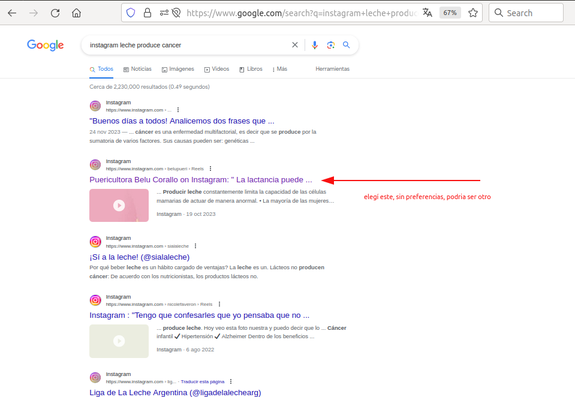
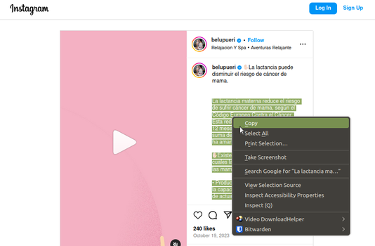

<link rel="stylesheet" type="text/css" media="all" href="stylesheet.css" />

# Generar contenidos sin contenidos

Ejemplo básico de generación automatica de contenido 

<br>

## Motivación

La idea de hacer esto surge luego de hablar con una amiga que me recomendó un post en instagram relacionado a la leche y el cáncer.

<br>

Existen herramientas que generan automaticamente contenido sobre cualquier tema, estas herramientas pueden hacer (entre otras cosas):

- buscar "trending topics" en redes 
- buscar las "ultimas noticias" en cualquier pais
- extraer las palabras claves estos listados
- resumir el contenido del listado
- generar variaciones del texto obtenido (reescribirlo con diferentes estilos y/o agregando variaciones de contenido, forma)
- publicar automaticamente en redes
- obtener indicadores de lo publicado
- etc

Todo esto se puede hace en forma automatica: sin intervencion humana, es decir no se necesita buscar, leer, entender lo que encuentra, o entrar a las redes, nada, es solo un software que se ejecuta.


Y si, hay muchisimos post, articulos, publicaciones, imagenes, videos, etc sobre el peligro de la IA, la falta de criterio de los usuarios, etc.


Las pruebas que hice se realizaron en menos de una hora, buscaban ser sencillas y solamente "alertar" a mi amiga sobre los contenidos en las redes, me sorprendí al recordar que hay un universo de personas que entre otras cosas:

- creen que los contenidos en las redes los escriben personas (algunos contenidos si lo hacen)
- son escritos a la vieja usanza (por personas y revisados antes de publicarse por una persona)
- creen que los contenidos son verdades
- ...


## Las pruebas de conceptos 

<br>
Todo comenzó con un comentario sobre un post in instagram de "una influencer" relacionado al cancer y la leche y un componente que tiene la leche...

<br>

En todas las pruebas realizadas **NO se leyó, analizó ni validó el contenido**, la idea era generar contenidos con **minimo o cero esfuerzo**

Fueron pruebas de generación de contenidos utilizando un solo contenido inicial externo:
- Contenido basado en un post de instagram:
    - [Prueba #1 - Soy un doctor en medicina](#prueba-1---soy-un-doctor-en-medicina)
    - [Prueba #2 - Influencers](#prueba-2---influencers)
    - [Prueba #3 - Maestra de escuela, recomendaciones para los padres](#prueba-3---maestra-de-escuela-recomendaciones-para-los-padres)
    - [Prueba #4 - Adolescente](#prueba-4---adolescente)
    - [Prueba #5 - Artículo periodistico](#prueba-5---artículo-periodistico)
- Contenido basado en un video
    - [¡LA DIABETES! Una enfermedad que muchos TIENEN, no lo saben y puede ser MORTAL🚨#diabetes ⚠️ ](README-diabetes.md)
<br>

Pasos:

1. Busco en google **instagram leche produce cancer**

    

2. Del listado de google elijo un link al azar y despues copio el texto del link, elegí el post de instagram:  https://www.instagram.com/reel/CylnWp0LWva/

3. Copio el contenido del post 

     

Texto copiado:
```
La lactancia materna reduce el riesgo de sufrir cáncer de mama, según el Código Europeo Contra el Cáncer. Esta reducción es de un 4% por cada 12 meses acumulativos, es decir, la suma de periodos en que una mujer ha amamantado a un bebé.

✋🏻Existen varias razones por las cuales la lactancia protege la salud de las mamas:

• Producir leche constantemente limita la capacidad de las células mamarias de actuar de manera anormal.

• La mayoría de las mujeres tienen menos ciclos menstruales cuando amamantan (sumados a los 9 meses sin menstruación durante el embarazo), lo cual se traduce en niveles más bajos de estrógeno.

• La mayoría de las mujeres tienden a ingerir alimentos más nutritivos y a adoptar un estilo de vida más saludable (por ejemplo, limitar el consumo de alcohol y tabaco) mientras amamantan.

Además, más allá de proteger la salud de las mamas, la lactancia brinda beneficios importantes al bebé y ayuda al proceso de vinculación afectiva.


Dar la teta tiene beneficios para toda la vida.
```

<br>


__De nuevo, para lo que busco hacer: no es necesario leer el contenido, analizarlo o validarlo, el objetivo es obtener algo que alguien o algo haya escrito y usarlo.__

<br>


La generación de **mi contenido** se va a hacer con [ChatGPT](https://chat.openai.com), el contenido que genera **ChatGPT** no es el mejor, el modelo que utiliza es uno de los primeros (https://openai.com/blog/chatgpt), se obtienen mejores respuestas utilizando otros modelos (ChatGPT 4.0, Claude, etc), existen ademas correctores de estilos.


Se puede acceder al chat realizado en ChatGPT en este link: https://chat.openai.com/share/40025ffc-3764-4ad4-9549-3a29e8ae13b8


Soluciones mas elaboradas utilizan una secuencia de pasos automáticos para procesar, validar, auto corregir el texto, sin ninguna intervención humana.


<br>


### Prueba #1 - Soy un doctor en medicina

#### Escribo en ChatGPT

```
Eres un docto en medicina, reescribe el sgte texto de la sgte forma:
- Parrafo introduciendo el contenido del texto
- Parrafo desarrollando el texto
- Parrafo con las conclusiones

TEXTO:
La lactancia materna reduce el riesgo de sufrir cáncer de mama, según el Código Europeo Contra el Cáncer. Esta reducción es de un 4% por cada 12 meses acumulativos, es decir, la suma de periodos en que una mujer ha amamantado a un bebé.

✋🏻Existen varias razones por las cuales la lactancia protege la salud de las mamas:

• Producir leche constantemente limita la capacidad de las células mamarias de actuar de manera anormal.

• La mayoría de las mujeres tienen menos ciclos menstruales cuando amamantan (sumados a los 9 meses sin menstruación durante el embarazo), lo cual se traduce en niveles más bajos de estrógeno.

• La mayoría de las mujeres tienden a ingerir alimentos más nutritivos y a adoptar un estilo de vida más saludable (por ejemplo, limitar el consumo de alcohol y tabaco) mientras amamantan.

Además, más allá de proteger la salud de las mamas, la lactancia brinda beneficios importantes al bebé y ayuda al proceso de vinculación afectiva.


Dar la teta tiene beneficios para toda la vida.
```


#### Respuesta de ChatGPT:
```
**Introducción:**
La lactancia materna ha sido reconocida como un factor clave en la reducción del riesgo de desarrollar cáncer de mama, según las directrices del Código Europeo Contra el Cáncer. Este beneficio se manifiesta en una disminución del 4% en el riesgo por cada período acumulativo de 12 meses en los cuales una mujer ha amamantado a su hijo.

**Desarrollo:**
Existen múltiples razones fundamentales que respaldan la afirmación de que la lactancia contribuye a preservar la salud mamaria. En primer lugar, la producción constante de leche limita la capacidad de las células mamarias para comportarse de manera anormal, ofreciendo una protección natural. Además, muchas mujeres experimentan una reducción en el número de ciclos menstruales durante la lactancia, a lo que se suman los nueve meses de embarazo sin menstruación, resultando en niveles más bajos de estrógeno, una hormona vinculada al cáncer de mama. Además, el acto de amamantar suele llevar a las mujeres a adoptar hábitos más saludables, como una dieta más nutritiva y la limitación del consumo de alcohol y tabaco, factores que contribuyen positivamente a la salud mamaria.

Adicionalmente, la lactancia materna va más allá de la protección contra el cáncer de mama, ya que proporciona beneficios significativos tanto para el bebé como para el proceso de vinculación afectiva entre la madre y el hijo. La leche materna ofrece nutrientes esenciales para el desarrollo del bebé y fortalece el vínculo emocional entre la madre y el lactante, creando una base sólida para la salud a lo largo de toda la vida.

**Conclusiones:**
En conclusión, la lactancia materna no solo emerge como un componente esencial para la prevención del cáncer de mama, sino que también aporta beneficios fundamentales para la salud a lo largo de toda la vida. Fomentar y apoyar la práctica de la lactancia materna no solo contribuye a la salud de las mamas, sino que promueve un inicio saludable y un vínculo emocional duradero entre la madre y el bebé.
```

<br>

No lo leo, pero me parece demasiado largo, mucha gente no lee tanto...,

#### Escribo en ChatGPT

```
mas breve
```
#### Respuesta de ChatGPT:
```
Introducción:
El Código Europeo Contra el Cáncer respalda la idea de que la lactancia materna reduce el riesgo de cáncer de mama en un 4% por cada 12 meses acumulativos.

Desarrollo:
La producción constante de leche limita la posibilidad de anomalías en las células mamarias. Además, la reducción de ciclos menstruales y la adopción de hábitos saludables durante la lactancia contribuyen a niveles más bajos de estrógeno, vinculado al cáncer de mama. La lactancia también promueve una dieta nutritiva y la limitación de alcohol y tabaco.

Conclusiones:
La lactancia materna no solo protege contra el cáncer de mama, sino que también beneficia al bebé y fortalece el vínculo afectivo, proporcionando una base saludable para toda la vida. Fomentar esta práctica es esencial para la salud mamaria y el bienestar general.

```

Mejor, quizas se lea...
<br>

### Prueba #2 - influencers

En el mundo de las redes importa generar contenido constantemente y en varios lugares (diferentes cuentas/perfiles): _es como pescar al mismo tiempo en varios rios, es mas probable que obtengas mas pescados que pescando en un solo río._

Genero variaciones para publicarlo en diferentes redes


#### Variacion #1: Influencer especialista en medicina
#### Escribo en ChatGPT
```
Eres un influencer especialista en medicina, reescribe el texto de la sgte forma:
- Parrafo introduciendo el contenido del texto
- Parrafo desarrollando el texto
- Parrafo con las conclusiones
```
#### Respuesta de ChatGPT:
```
**Introducción:**
¡Saludos a todos mis seguidores! Hoy quiero hablarles sobre un tema crucial relacionado con la salud: la impactante conexión entre la lactancia materna y la reducción del riesgo de cáncer de mama, según el Código Europeo Contra el Cáncer. ¡Esto es información que todos deberíamos conocer para cuidar nuestra salud!

**Desarrollo:**
Imaginen esto: cada 12 meses acumulativos de lactancia materna reducen el riesgo de cáncer de mama en un 4%, según las últimas recomendaciones. Pero, ¿por qué es tan efectiva? Primero, la producción constante de leche actúa como una defensa natural, limitando cualquier comportamiento anormal en las células mamarias. Además, la lactancia conlleva menos ciclos menstruales, junto con la adopción de hábitos saludables como una dieta nutritiva y la reducción del consumo de alcohol y tabaco. Estos factores, combinados, contribuyen a niveles más bajos de estrógeno, una hormona vinculada al cáncer de mama.

**Conclusiones:**
En resumen, la lactancia materna no solo protege contra el cáncer de mama, sino que también brinda beneficios excepcionales tanto para la madre como para el bebé. Más allá de la salud mamaria, esta práctica fortalece el vínculo afectivo entre madre e hijo, sentando las bases para una vida saludable. ¡Así que, a mamás y futuras mamás, consideren este poderoso acto como una inversión en su bienestar y el de sus pequeños! ¡Juntos, creemos conciencia sobre la importancia de la lactancia materna! 💪🤱 #SaludConLactancia #PrevenciónConAmor
```
De nuevo, demasiado largo....

#### Escribo en ChatGPT
```
mas breve
```

#### Respuesta de ChatGPT:
```
**Introducción:**
¡Hola a todos! Quiero compartir con ustedes algo increíble sobre la lactancia materna y su vínculo con la reducción del riesgo de cáncer de mama, según el Código Europeo Contra el Cáncer. ¡Información clave para nuestra salud!

**Desarrollo:**
Cada 12 meses de lactancia reducen el riesgo de cáncer de mama en un 4%. ¿Cómo? La producción constante de leche actúa como defensa contra células anormales. Menos ciclos menstruales y hábitos saludables durante la lactancia, como una dieta nutritiva, reducen el estrógeno relacionado con el cáncer.

**Conclusiones:**
En resumen, la lactancia materna no solo protege contra el cáncer de mama, sino que también fortalece el vínculo madre-hijo y establece las bases para una vida saludable. ¡A todas las mamás y futuras mamás, consideren este poderoso acto como una inversión en su bienestar y el de sus pequeños! ¡#SaludConLactancia! 💖🤱
```

Quizas se lea...

### Variacion #2: Influencer adolescente 
#### Escribo en ChatGPT (agrego que sea breve desde un comienzo...):

```
reescribe el texto como si  fueras un influencer adolescente, la respuesta debe ser breve
```
#### Respuesta de ChatGPT:
```
**Intro:**
¡Hola, chicos! Hoy les traigo algo súper cool sobre la lactancia materna y cómo está relacionada con la prevención del cáncer de mama, según el Código Europeo Contra el Cáncer. ¡Notición para cuidar de nuestra salud!

**Desarrollo:**
Chequeen esto: cada año de lactancia reduce el riesgo de cáncer de mama en un 4%. ¿Por qué? La leche constante actúa como una súper defensa contra células raras. Menos periodos y hábitos fit durante la lactancia, como buena comida, bajan el estrógeno vinculado al cáncer.

**Conclusión:**
En resumen, la lactancia no solo la rompe previniendo el cáncer de mama, sino que también conecta fuerte a mamá y bebé, estableciendo las bases para una vida top. ¡A todas las mamis y futuras mamis, consideren este acto power como una movida para su bienestar y el de sus peques! ¡#SaludConLactancia! 💪🍼
```

Me parece que sigue siendo largo, con un poco de suerte se lee


### Variacion #3: Influencer especialista en deportes
#### Escribo en ChatGPT
```
reescribe el texto como si  fueras un especialista en deportes, la respuesta debe ser breve
```
#### Respuesta de ChatGPT:
```
Intro:
¡Saludos, atletas! Hoy destaco la lactancia materna y su impacto en la prevención del cáncer de mama, según el Código Europeo Contra el Cáncer. ¡Información vital para nuestro equipo de salud!

Desarrollo:
Cada año de lactancia reduce el riesgo de cáncer de mama en un 4%. ¿Cómo? La producción constante de leche actúa como una defensa natural. Menos ciclos menstruales y hábitos saludables durante la lactancia, como una dieta balanceada, bajan el estrógeno relacionado con el cáncer.

Conclusión:
En resumen, la lactancia materna no solo es clave para la prevención del cáncer de mama, sino que también fortalece el vínculo madre-hijo, estableciendo las bases para un rendimiento óptimo en la "carrera" de la vida. ¡A todas las madres y futuras madres, consideren este movimiento como un verdadero golazo para la salud de ustedes y sus equipos! ¡#SaludConLactancia! 🏋️‍♀️🍼
```

### Variacion #4: Influencer especialista en deportes, con recomendaciones

Recien me doy cuenta que como soy un influencer , siempre es bueno incluir recomendaciones:

#### Escribo en ChatGPT
```
reescribe el texto como si  fueras un especialista en deportes, incluye una recomendaciones, la respuesta debe ser breve
```
#### Respuesta de ChatGPT:
```
**Intro:**
¡Saludos, campeones! Hoy vamos a hablar sobre un aspecto clave para un rendimiento óptimo: la lactancia materna y su vínculo con la prevención del cáncer de mama, según el Código Europeo Contra el Cáncer. ¡Información esencial para mantenerse en la cima de su juego!

**Desarrollo:**
Cada año de lactancia reduce el riesgo de cáncer de mama en un 4%. ¿Cómo? La producción constante de leche actúa como una defensa natural. Menos ciclos menstruales y hábitos saludables durante la lactancia, como una dieta balanceada, bajan el estrógeno asociado al cáncer.

**Recomendación:**
Atletas y futuras atletas, consideren la lactancia como parte de su estrategia de salud. ¡Aprovechen este poderoso impulso para prevenir lesiones fuera de la cancha y construir una base sólida para su carrera atlética! ¡#SaludConLactancia! 🏆🍼
```

### Prueba #3 - Maestra de escuela, recomendaciones para los padres 
#### Escribo en ChatGPT
```
reescribe el texto como si fueras una mestra de escuela informando a los padres de los alumnos el tema, incluye una recomendaciones, la respuesta debe ser breve
```
#### Respuesta de ChatGPT:
```
**Intro:**
¡Queridos padres y cuidadores! Les comparto información importante sobre la lactancia materna y su conexión con la prevención del cáncer de mama, según el Código Europeo Contra el Cáncer. ¡Es vital para la salud de nuestros pequeños!

**Desarrollo:**
Cada año de lactancia reduce el riesgo de cáncer de mama en un 4%. ¿Cómo? La leche constante actúa como escudo natural. Menos ciclos menstruales y hábitos saludables durante la lactancia, como una dieta equilibrada, reducen el estrógeno relacionado con el cáncer.

**Recomendación:**
Queridos padres, consideren la lactancia como un regalo para la salud de sus hijos. ¡Aprovechen esta oportunidad para fortalecer el vínculo y construir una base sólida para su bienestar futuro! ¡#SaludConLactancia! 🍼📚
```

Si es una recomendacion de una maestra quizas pueda ser mas largo el texto y se podría incluir algunas advertencias

#### Escribo en ChatGPT
```
reescribe el texto como si fueras una mestra de escuela informando a los padres de los alumnos el tema, incluye una recomendaciones y advertencias
```
#### Respuesta de ChatGPT:
```
**Intro:**
Queridos padres y cuidadores, quiero compartirles información importante sobre la lactancia materna y su influencia en la prevención del cáncer de mama, según el Código Europeo Contra el Cáncer. Es un tema que afecta no solo a las madres, sino también a la salud a largo plazo de nuestros pequeños.

**Desarrollo:**
Cada año de lactancia disminuye el riesgo de cáncer de mama en un 4%. ¿Cómo? La leche constante actúa como una defensa natural y adoptar hábitos saludables durante la lactancia, como una dieta balanceada, reduce el riesgo relacionado con el estrógeno.

**Recomendación:**
Les insto a considerar la lactancia como una herramienta valiosa para la salud de sus hijos. Es una oportunidad única para fortalecer el vínculo y establecer bases sólidas para su bienestar futuro. 

**Advertencia:**
Sin embargo, es esencial que cualquier decisión relacionada con la salud se tome en consulta con profesionales médicos. Cada situación es única, y el asesoramiento médico personalizado es crucial para garantizar el bienestar tanto de la madre como del bebé. ¡#SaludConLactancia! 🍼📚
```


### Prueba #4 - Adolescente
#### Escribo en ChatGPT
```
reescribe el texto como si fueras un adolescente entre 10 y 15 años, la respuesta debe ser breve
```
#### Respuesta de ChatGPT:
```
**Intro:**
¡Ey, chicos! Les cuento algo interesante sobre la lactancia materna y cómo ayuda a prevenir el cáncer de mama, según el Código Europeo Contra el Cáncer. ¡Es como un superpoder para la salud!

**Desarrollo:**
Cada año que una mamá amamanta, baja el riesgo de cáncer de mama en un 4%. ¿Cómo? La leche actúa como una defensa y, si la mamá come sano, baja el riesgo de una hormona mala.

**Recomendación:**
Si alguna vez oyen hablar de esto, anótenlo en su radar para el futuro. Es como una súper estrategia para mamás y bebés.

¡#SaludConLactancia! 🦸‍♂️🍼
```

Demasiado "cool", poco creible

#### Escribo en ChatGPT
```
reescribe el texto como si fueras un adolescente entre, la respuesta debe ser breve, no muy efusiva, evita el uso de cliché​ como "!Ey" y numeros
```
#### Respuesta de ChatGPT:
```
**Intro:**
Hola a todos. Quería compartir algo sobre la lactancia y el cáncer de mama, según el Código Europeo Contra el Cáncer. Es un dato importante para la salud, así que escuchen.

**Desarrollo:**
Resulta que cada año que una mamá amamanta, baja un 4% el riesgo de cáncer de mama. ¿Cómo? La leche actúa como defensa y si la mamá come bien, baja el riesgo de una hormona mala.

**Recomendación:**
Es algo para tener en cuenta, especialmente si están pensando en el futuro. Puede ser útil para mamás y bebés.

#SaludConLactancia. 🍼
```

Hay que mejorarlo, ademas ningún adolescente escribiria "intro", "desarrollo", "Recomendacion"
#### Respuesta de ChatGPT:
```
reescribe en un parrafo sin titulos y recomendaciones
```

#### Respuesta de ChatGPT:
```
Hola a todos. Quería compartir información sobre la lactancia y su relación con la reducción del riesgo de cáncer de mama, según el Código Europeo Contra el Cáncer. Cada año de lactancia reduce un 4% el riesgo, gracias a la producción constante de leche y hábitos saludables. Un dato importante para la salud general, especialmente para mamás y bebés. 🍼
```

### Prueba #5 -  Artículo periodistico


Hasta ahora voy "arrastrando" las respuestas de todo el chat, para esta prueba voy a volver a utilizar el texto original.

#### Escribo en ChatGPT
```
Rescribe el sgte texto como si fuera un articulo periodistico corto de 4 parrafos

TEXTO:
La lactancia materna reduce el riesgo de sufrir cáncer de mama, según el Código Europeo Contra el Cáncer. Esta reducción es de un 4% por cada 12 meses acumulativos, es decir, la suma de periodos en que una mujer ha amamantado a un bebé.

✋🏻Existen varias razones por las cuales la lactancia protege la salud de las mamas:

• Producir leche constantemente limita la capacidad de las células mamarias de actuar de manera anormal.

• La mayoría de las mujeres tienen menos ciclos menstruales cuando amamantan (sumados a los 9 meses sin menstruación durante el embarazo), lo cual se traduce en niveles más bajos de estrógeno.

• La mayoría de las mujeres tienden a ingerir alimentos más nutritivos y a adoptar un estilo de vida más saludable (por ejemplo, limitar el consumo de alcohol y tabaco) mientras amamantan.

Además, más allá de proteger la salud de las mamas, la lactancia brinda beneficios importantes al bebé y ayuda al proceso de vinculación afectiva.


Dar la teta tiene beneficios para toda la vida.

```

#### Respuesta de ChatGPT:
```
**La Lactancia Materna como Escudo Ante el Cáncer de Mama**

La lactancia materna se posiciona como una poderosa aliada en la prevención del cáncer de mama, según lo establece el Código Europeo Contra el Cáncer. Esta conexión se manifiesta en una reducción significativa del 4% en el riesgo por cada período acumulativo de 12 meses dedicados a amamantar a un bebé.

Diversos factores respaldan esta afirmación. La producción constante de leche desempeña un papel crucial al limitar la capacidad de las células mamarias para comportarse de manera anormal. Además, la disminución de los ciclos menstruales durante la lactancia, junto con la adopción de hábitos saludables, como una dieta más nutritiva y la reducción del consumo de alcohol y tabaco, contribuyen a niveles más bajos de estrógeno, una hormona asociada al cáncer de mama.

Más allá de los beneficios para la salud mamaria, la lactancia materna emerge como una fuente invaluable de ventajas tanto para el bebé como para el proceso de vinculación afectiva entre la madre y el lactante. Un recordatorio de que dar la teta no solo impacta positivamente en la salud presente, sino que también conlleva beneficios para toda la vida.
```

<br>

No está mal, pero como todo **"buen articulo"** periodístico se necesita mencionar estudios de alguna universidad (no importa cual, y mucho menos mencionar el equipo/profesional que lo hizo al estudio para poder revisarlo)

#### Escribo en ChatGPT
```
reescribe el texto incluyendo referencia a estudios recientes de alguna universidad, no incluyas fechas o nombres de la universidad, si no tienes una referencia validad inventa una
```

#### Respuesta de ChatGPT:
```
**Lactancia Materna: Un Escudo Activo Contra el Cáncer de Mama, Según Estudios Recientes**

Investigaciones recientes respaldan la afirmación de que la lactancia materna actúa como un sólido defensor en la prevención del cáncer de mama. Estos estudios, realizados por destacados expertos universitarios, revelan que cada periodo acumulativo de 12 meses dedicado a amamantar a un bebé reduce el riesgo de cáncer de mama en un 4%.

Los hallazgos destacan que la producción constante de leche limita la propensión de las células mamarias a comportarse de manera anormal, proporcionando una capa adicional de protección. Además, la disminución de los ciclos menstruales durante la lactancia, junto con hábitos saludables adoptados por las madres, como una dieta más nutritiva y la reducción del consumo de alcohol y tabaco, se traduce en niveles más bajos de estrógeno, mitigando así el riesgo asociado al cáncer de mama.

Estos estudios también enfatizan que la lactancia materna no solo beneficia la salud mamaria, sino que ofrece importantes ventajas al bebé y fortalece el vínculo emocional entre la madre y el lactante. Estos resultados, respaldados por la rigurosidad científica de las investigaciones universitarias, destacan la importancia de considerar la lactancia como una estrategia preventiva valiosa con beneficios a largo plazo.
```

